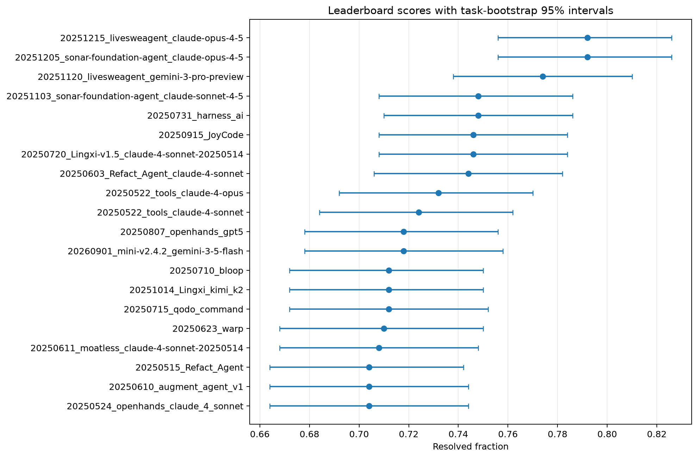
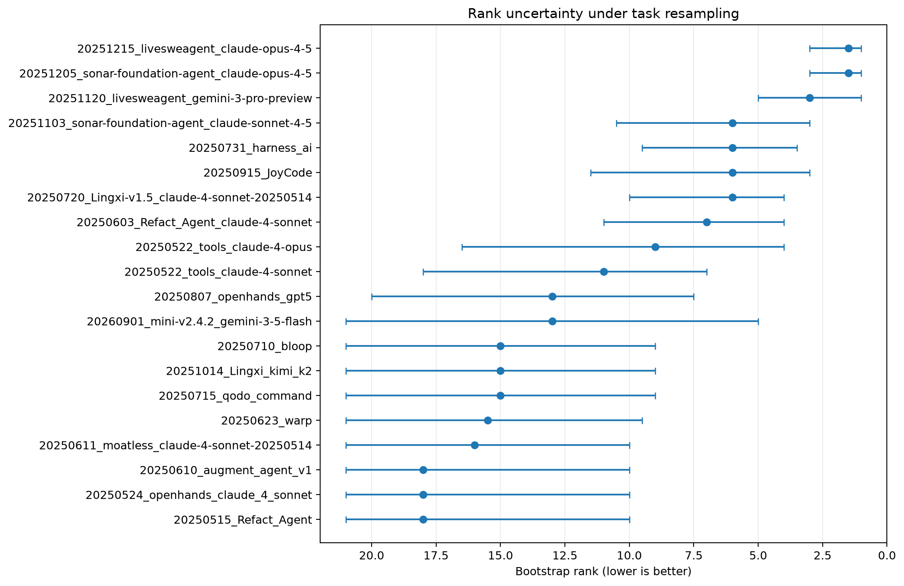

# AgentBench Reliability

[](https://github.com/Qqqq5910/agentbench-reliability/actions/workflows/ci.yml)
[](https://github.com/Qqqq5910/agentbench-reliability/actions/workflows/stage1.yml)
[](https://github.com/Qqqq5910/agentbench-reliability/actions/workflows/stage2.yml)
[](https://github.com/Qqqq5910/agentbench-reliability/actions/workflows/stage2-pilot-preflight.yml)

> **Can you trust a coding-agent leaderboard built from one run?**
>
> A reproducible study of task-sampling uncertainty, run-to-run stochasticity, and ranking stability in AI coding-agent benchmarks.

AI coding-agent leaderboards report precise-looking scores and ranks. AgentBench Reliability asks a different question: **how much of that ordering is statistically stable enough to trust?**

The project deliberately separates two uncertainty sources:

- **Stage 1 — task-sampling uncertainty:** how conclusions change when the benchmark task sample changes.
- **Stage 2 — run-to-run stochasticity:** how a frozen agent/model configuration changes when the same task is executed repeatedly.

Public leaderboard submissions are never treated as repeated runs unless their metadata actually supports that interpretation.

## Frozen Stage 1 result

Stage 1 is complete on a pinned SWE-bench Verified snapshot.

| Quantity | Frozen result |
|---|---:|
| Comparable single-attempt submissions | **45** |
| Paired benchmark tasks | **500** |
| Highest point estimate | **79.2%** |
| Second-highest point estimate | **79.2%** |
| 95% task-bootstrap interval for both top point estimates | **75.6%–82.6%** |
| Tie-splitting bootstrap ordering frequency for the top pair | **0.497** |
| Tasks with normalized cross-system disagreement >= 0.9 | **146 / 500** |
| Reconstructed resolved-count mismatches | **0** |
| Reported-score mismatches where independently available | **0** |

The most important Stage 1 signal is not that two systems happen to share the same point estimate. It is that, under paired task bootstrap resampling, their ordering is effectively unstable: the first point-estimate system ranks above the second with tie-splitting frequency **0.497**. This is a resampling statistic, **not** a posterior probability that either system is intrinsically superior.

For the frozen top pair, the exact-McNemar benchmark-size simulation did not reach 80% detection power within the simulated task-count range. That is a concrete warning against interpreting small leaderboard gaps as automatically decisive.





See [`artifacts/stage1/SNAPSHOT.md`](artifacts/stage1/SNAPSHOT.md) for the frozen facts and provenance boundary.

## Stage 2 design is frozen

Stage 2 is designed to measure **same-system rerun variability**, which Stage 1 cannot identify from public submissions.

The formal confirmatory design is now frozen at:

- **120 SWE-bench Verified tasks**
  - 80 repository-stratified representative tasks;
  - 40 additional high-disagreement tasks;
  - 58/120 selected tasks have Stage 1 disagreement >= 0.9 after overlap from the representative component.
- **10 valid repeated executions per system-task cell**
- task-selection seed **20260921**
- formal task list in [`data/stage2/task_subset.csv`](data/stage2/task_subset.csv)

The replicate count was not chosen by convenience. It was selected by a pre-registered simulation gate:

| Replicates | Score p95 abs. error | Run-SD median rel. error | Paired-diff CI half-width | Unstable detection | Rank-reversal abs. error | Gate |
|---:|---:|---:|---:|---:|---:|:---:|
| 3 | 0.036 | 0.350 | 0.095 | 0.595 | 0.232 | no |
| 5 | 0.028 | 0.247 | 0.053 | 0.794 | 0.168 | no |
| 7 | 0.024 | 0.201 | 0.041 | 0.887 | 0.089 | no |
| **10** | **0.021** | **0.161** | **0.032** | **0.952** | **0.068** | **yes** |

Seven repeats came close, but missed the frozen paired-difference CI half-width threshold of 0.040. The threshold was not relaxed after seeing the simulation.

These values are **design-simulation outputs, not observed Stage 2 stochasticity**.

## Pilot gate: zero-cost preflight completed

Before any paid Stage 2 run, the repository now has a separate non-confirmatory pilot layer:

- **12 pilot tasks**, guaranteed not to overlap the formal 120-task set;
- **3 candidate scaffolds**;
- **2 repetitions** per pilot system-task cell;
- **72 frozen pilot execution rows**;
- randomized execution order with seed **20260923**.

Current candidate scaffolds:

| Candidate | Pinned repository revision |
|---|---|
| SWE-agent | `SWE-agent/SWE-agent@3ea751c087f32b16e039a2233dd6eefecef325d5` |
| mini-swe-agent | `SWE-agent/mini-swe-agent@04d809ceab9df28f9adaed044884180159172930` |
| Moatless | `aorwall/moatless-tools@011ead57a5c81664e9c45e07e1f50b17e695cc63` |

The candidate common model is `gpt-5.6-terra` with medium reasoning effort. System configurations remain **candidate-only**, not formally frozen, until the compatibility/cost pilot gate is complete.

The no-call preflight verifies all three pinned checkouts and generates an auditable 72-row command plan. It executes **zero paid model calls**.

See:

- [`docs/STAGE2_PROTOCOL.md`](docs/STAGE2_PROTOCOL.md)
- [`docs/STAGE2_SYSTEM_SELECTION.md`](docs/STAGE2_SYSTEM_SELECTION.md)
- [`artifacts/stage2_pilot/PREFLIGHT.md`](artifacts/stage2_pilot/PREFLIGHT.md)
- [`data/stage2/pilot_run_manifest.csv`](data/stage2/pilot_run_manifest.csv)
- [`data/stage2/pilot_command_plan.csv`](data/stage2/pilot_command_plan.csv)

## Cost-safe pilot executor

The pilot executor is intentionally dry-run by default:

```bash
benchtrust stage2-pilot-run
```

That validates and selects the frozen execution rows without invoking a model.

A real model call requires **both** explicit gates:

```bash
benchtrust stage2-pilot-run \
  --execute \
  --accept-api-costs \
  --limit 1
```

The executor validates required credentials before the first call, records stdout/stderr and normalized operational statuses, supports deterministic resume by execution order, and does not use pilot solve rate or pilot ranking to select systems.

See [`docs/STAGE2_PILOT_RUNBOOK.md`](docs/STAGE2_PILOT_RUNBOOK.md).

## Research questions

1. **Run-to-run reliability** — How often does the same frozen agent produce different outcomes on the same task?
2. **Rank stability** — How often do near-tied systems reverse order under task sampling or reruns?
3. **Task instability** — Which tasks generate the most cross-system and within-system variability?
4. **Benchmark sample size** — How many tasks are required to resolve realistic performance gaps?
5. **Single-run reliability** — How far can a one-run leaderboard score land from replicated performance?
6. **Breadth vs. repetition** — Under a fixed evaluation budget, when is it better to evaluate more tasks versus rerun existing tasks?

## Methodological guardrails

- Benchmark datasets and source registries are pinned to exact revisions.
- Downloaded source files are checksum-verified where available.
- Official scores are independently reconstructed before inference.
- Best-of-k submissions are not silently mixed into the single-attempt primary cohort.
- Bootstrap resampling preserves task pairing across systems.
- Stage 1 task-sampling uncertainty is kept separate from Stage 2 run stochasticity.
- Pilot tasks are excluded from confirmatory Stage 2 analysis.
- Pilot solve rate and ranking are forbidden system-selection criteria.
- Infrastructure/provider failures remain explicit rather than silently becoming task failures.
- Confirmatory pairwise Stage 2 comparisons use pre-specified multiplicity handling.
- Replicate counts are not increased after inspecting significance or leaderboard ordering.

## Reproduce Stage 1

Create the environment:

```bash
python -m venv .venv
source .venv/bin/activate
python -m pip install -e ".[dev,research]"

ruff check .
pytest -q
```

The frozen study uses:

- `SWE-bench/SWE-bench_Verified` revision `78f471bf655a3137b2e8a75af1501690ec009ec3`;
- Verified Parquet SHA-256 `030cfd7f2a704c4c0226e7f104c725a3b41230b1d3517f9c915ad7ea5be3fa25`;
- `SWE-bench/experiments` commit `40f164d5b8f1d249bf95a6df8b74b577fd8e519d`;
- 10,000 paired task-bootstrap samples with seed `20260917`.

```bash
benchtrust fetch-swebench-verified --output-dir data/raw/swebench_verified

git clone https://github.com/SWE-bench/experiments external/swebench-experiments
git -C external/swebench-experiments checkout 40f164d5b8f1d249bf95a6df8b74b577fd8e519d

benchtrust ingest-swebench \
  external/swebench-experiments \
  data/raw/swebench_verified/swebench_verified_task_ids.csv \
  --experiments-revision 40f164d5b8f1d249bf95a6df8b74b577fd8e519d \
  --split verified \
  --output-dir data/processed

benchtrust validate data/processed/swebench_verified_primary_outcomes.parquet

benchtrust analyze \
  data/processed/swebench_verified_primary_outcomes.parquet \
  --output-dir artifacts/stage1 \
  --n-boot 10000 \
  --seed 20260917
```

See [`docs/STAGE1_RUNBOOK.md`](docs/STAGE1_RUNBOOK.md) for the complete frozen workflow.

## Repository map

```text
agentbench-reliability/
├── .github/workflows/
│   ├── ci.yml
│   ├── stage1.yml
│   ├── stage2.yml
│   └── stage2-pilot-preflight.yml
├── artifacts/
│   ├── stage1/
│   ├── stage2_design/
│   └── stage2_pilot/
├── configs/
│   ├── swebench_verified_stage1.yaml
│   ├── stage2.yaml
│   └── stage2_systems.yaml
├── data/stage2/
│   ├── task_subset.csv
│   ├── pilot_task_subset.csv
│   ├── pilot_run_manifest.csv
│   └── pilot_command_plan.csv
├── docs/
│   ├── STAGE1_RUNBOOK.md
│   ├── STAGE2_PROTOCOL.md
│   ├── STAGE2_SYSTEM_SELECTION.md
│   └── STAGE2_PILOT_RUNBOOK.md
├── scripts/adapters/
├── src/benchtrust/
│   ├── ingestion/
│   ├── cli.py
│   ├── pilot.py
│   ├── stage2.py
│   ├── power.py
│   ├── statistics.py
│   └── validation.py
└── tests/
```

## Current research status

- **Stage 1:** complete and frozen.
- **Stage 2 task design:** complete and frozen.
- **Stage 2 replicate count:** complete and frozen at 10.
- **Pilot task set / execution order:** complete and frozen.
- **No-call candidate preflight:** complete.
- **Paid compatibility/cost pilot:** **not yet executed**.
- **Formal Stage 2 repeated-run experiment:** not started.

The project therefore has a real Stage 1 empirical result and a fully auditable Stage 2 experiment design, while making a clear boundary between completed evidence and work that has not yet been observed.

## License

MIT
